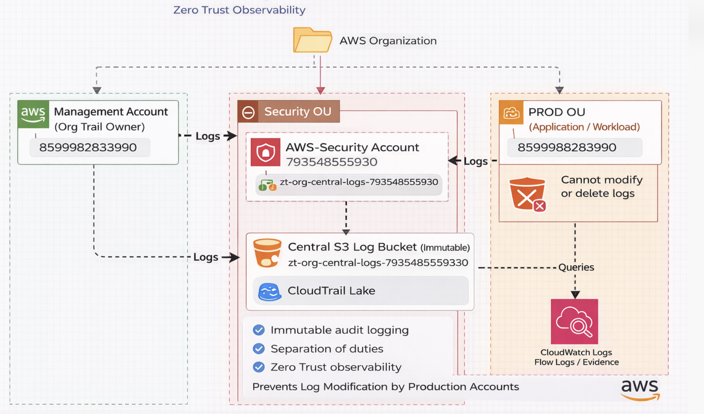

# ZT Governance — Organization Guardrails & Continuous Compliance

## 🎯 Objective

Implement **Zero Trust governance at the AWS Organization level** by enforcing security guardrails that cannot be bypassed — even by administrators.

This project demonstrates how centralized controls prevent security control disablement and continuously detect governance drift across multiple AWS accounts.

## 🏗 Controls Implemented

- Service Control Policies (SCP) for organization-level guardrails  
- IAM Access Analyzer for external access detection  
- CloudTrail Lake for governance event monitoring and query-based auditing  
- AWS Config Aggregator(optional) for cross-account compliance visibility  

## 🧪 Misuse Scenarios Tested

The following adversarial actions were simulated to validate enforcement:

- Attempt to disable GuardDuty  
- Attempt to delete CloudTrail  
- Attempt to create a public S3 bucket  
- Attempt to modify logging configuration  
- Attempt to create external trust relationships  

All actions were either blocked by SCP or detected by governance monitoring tools.

## 📂 Project Structure

| Folder | Purpose |
|------|------|
| `scp` | Service Control Policy guardrails |
| `access-analyzer` | External access detection |
| `cloudtrail-lake` | Governance event monitoring queries |
| `config-aggregator` | Cross-account compliance visibility |
| `architecture` | Architecture diagrams |
| `evidence` | Implementation screenshots |

---

## 🧠 Key Principle

Zero Trust must extend beyond workloads and data  
it must enforce governance boundaries at the organization level.

Security controls should be mandatory, centrally enforced, and continuously monitored**, ensuring that critical protections cannot be disabled or bypassed.
