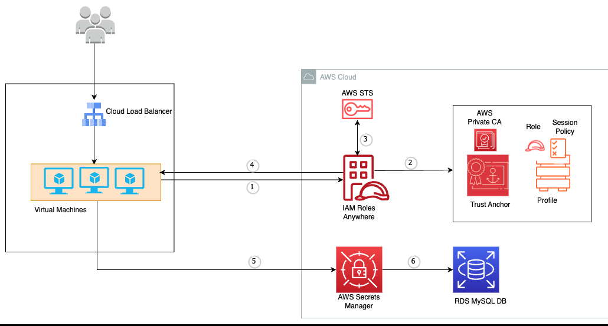

# AWS Zero Trust: Workload Identity & Secret Management

## 🎯 Project Overview
In a traditional environment, applications often store database credentials in local config files or use long-term IAM Access Keys. Both methods create a high risk of credential leakage. 

This project implements a **Zero Trust Architecture** where a workload (EC2 instance) is granted **identity-based**, temporary access to **AWS Secrets Manager**. By leveraging IAM Roles and IMDSv2, we eliminate hardcoded secrets and long-term credentials entirely.

## 🏗️ Architecture
The design follows the principle of "Never Trust, Always Verify." 



### Core Components:
* **Identity Provider**: AWS IAM (Instance Profiles).
* **Policy Enforcement Point**: AWS Secrets Manager.
* **Secure Compute**: Amazon EC2 hardened with IMDSv2.
* **Credential Lifecycle**: AWS Security Token Service (STS) for ephemeral tokens.

## 🛡️ Zero Trust Security Features
* **Elimination of Static Secrets**: No `.aws/credentials` or passwords stored on disk.
* **Least Privilege Access**: The workload identity is restricted to a single `GetSecretValue` action on a specific resource.
* **IMDSv2 Enforcement**: Hardened the instance metadata service to require session-oriented tokens, mitigating SSRF (Server-Side Request Forgery) risks.
* **Auditability**: Every secret access is logged in AWS CloudTrail for security monitoring and compliance.

## 📂 Project Structure & Evidence
* `architecture/`: Contains the system design blueprint.
* `evidence/`: Documented proof of successful implementation.
    * `iam-role-secrets-policy.png`: Verified least-privilege policy.
    * `ec2-role-attached.png`: Proof of workload identity binding.
    * `secret-retrieval.png`: Successful just-in-time retrieval (Sensitive data redacted).
* `scripts/`: Automation scripts for secret retrieval.

## 🚀 Technical Implementation (Developer Workflow)
To avoid hardcoding passwords, developers use the AWS SDK to fetch secrets into memory at runtime.

```bash
# Example retrieval via AWS CLI (used by our automation scripts)
aws secretsmanager get-secret-value \
    --secret-id zt-db-secret \
    --query SecretString \
    --output text

