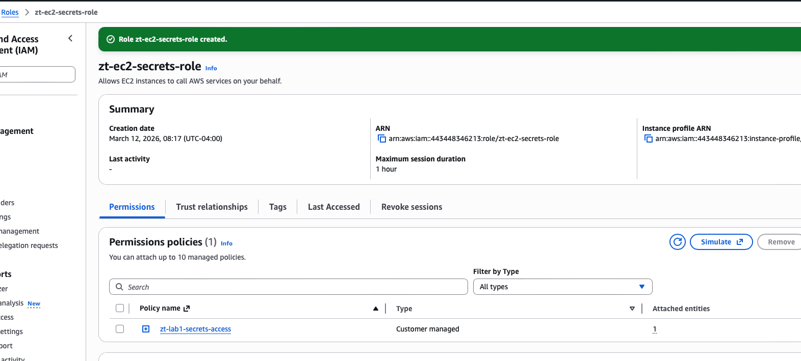
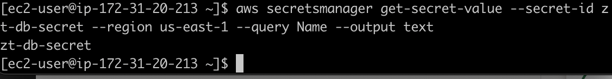

# AWS Zero Trust Secret Management Lab

## 🎯 Overview
This lab demonstrates a **Zero Trust** approach to application secret management. Instead of using long-term IAM Access Keys or hardcoded credentials, this architecture utilizes **IAM Roles** and **AWS Secrets Manager** to provide temporary, least-privilege access to sensitive data.

## 🏗️ Architecture
1. **AWS Secrets Manager**: Stores the database credentials securely.
2. **IAM Policy**: Defines the specific "GetSecretValue" permission.
3. **IAM Role**: Acts as the "Workload Identity" for the EC2 instance.
4. **Amazon EC2**: The compute resource that retrieves secrets using its attached identity via **IMDSv2**.

## 🛡️ Zero Trust Principles Applied
* **No Permanent Secrets**: Eliminated the need for `.aws/credentials` files on the server.
* **Least Privilege**: The IAM role is scoped strictly to the secret it needs.
* **Verifiable Identity**: Access is granted based on "who" the resource is, not "what" password it knows.
* **IMDSv2 Hardening**: Protected against SSRF attacks by requiring session-oriented metadata tokens.

## 📁 Evidence of Success
The following evidence was captured during the lab execution:

### 1. Secret Configuration
The secret was created in AWS Secrets Manager, encrypted with AWS KMS.

### 2. Workload Identity Setup
An IAM Role with a least-privilege policy was created and attached to the EC2 instance.

### 3. Successful Retrieval (Verification)
Using the AWS CLI on the EC2 instance, the secret was successfully retrieved via the instance's identity. 
*(Note: Sensitive values in the screenshot have been redacted for security).*

## 🛠️ Tools Used
* AWS CLI
* AWS IAM & Secrets Manager
* Amazon EC2 (Amazon Linux 2023)
* MacOS Terminal / SSH
