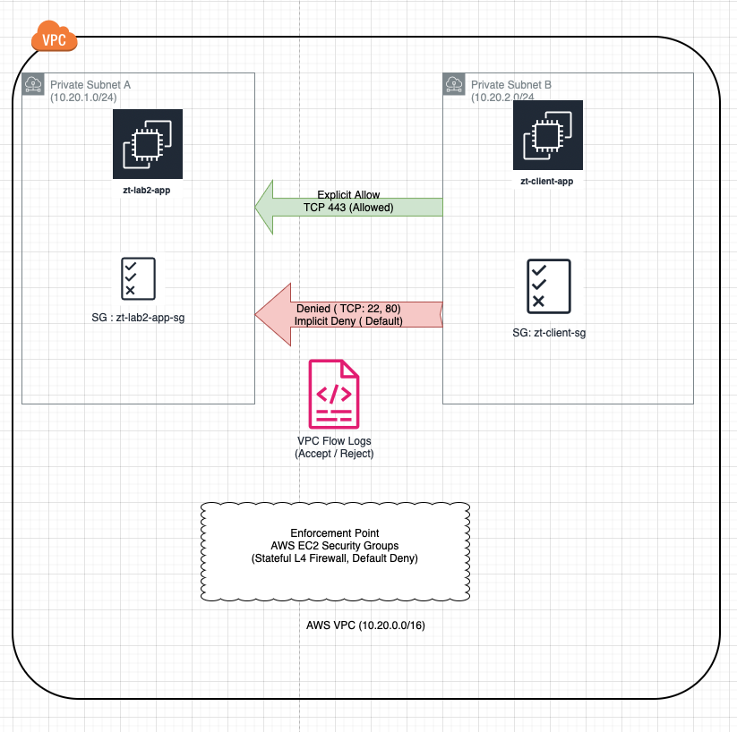

# ZT Network — Microsegmentation (Security Groups + Flow Logs)

## Objective
Demonstrate Zero Trust network enforcement by allowing only explicitly approved
traffic while denying all other access by default, with continuous verification
using VPC Flow Logs.

## Architecture

## Zero Trust Principles Applied
- Explicit allow (HTTPS only)
- Default deny (SSH and ICMP)
- No inbound internet access
- Continuous verification via telemetry

## Implementation Summary
- Security Groups restrict inbound access to TCP 443 only
- No SSH or ICMP allowed between workloads
- VPC Flow Logs capture ACCEPT and REJECT decisions at the ENI level

## Evidence
| Step | Description |
|-----|-------------|
| 01 | VPC CIDR and subnet isolation |
| 02 | Private route table (no IGW) |
| 03 | Security Group allows TCP 443 only |
| 04 | HTTPS access validated |
| 05 | Flow Logs show ACCEPT for 443 |
| 06 | Flow Logs show REJECT for SSH |
| 07 | ICMP denied |
| 08 | Reject counts by port |
| 09 | ENI-level telemetry verification |

## Outcome
This lab demonstrates enforceable Zero Trust network controls with auditable,
continuous verification aligned to NIST SP 800-207 principles.

